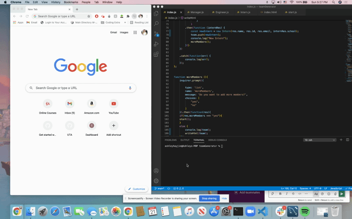

#  Team Builder 
## Table of Contents 
1. [Description](#Description)
2. [Installation](#Installation)
3. [Usage](#Usage)
4. [Preview](#Preview)

## Description 

You are able to build your team and cards to represent if they are a manager, intern, or engineer.

## Installation

VS Code and Inquirer

## Usage 
If you need to build a map of your team you can use this application to build a visual representation of them and cards to contact them

## Preview

## Github 

[Github]{www.github.com/ashleyhayjin}
https://github.com/ashleyhayjin/teamGenerator
https://ashleyhayjin.github.io/teamGenerator/

## Contact Me

If you have any other questions, contact me at my email : ashleyhayjinlee@gmail.com
